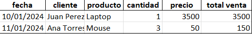

# Automatización de Reportes de Ventas (Python + SQL Server)

**Script en Python y SQL para extraer, procesar y generar reportes de ventas en Excel de forma automatizada.**

---

## Resumen del Proyecto

Este proyecto automatiza la **obtención de datos de ventas desde SQL Server**, su transformación con Python y la **generación de un reporte en Excel**, listo para análisis o distribución.  
Permite reducir el trabajo manual de generación de reportes y mejorar la precisión de la información utilizada por la gerencia.

---

## Impacto en el Negocio / Resultados Clave

- **Reducción significativa de tiempo manual** para la generación de reportes de ventas.  
- **Reporte estandarizado en Excel**, fácil de revisar y compartir entre equipos.  
- Facilita el análisis de tendencias y desempeño comercial sin intervención manual constante.

---

## Tecnologías Utilizadas

- Python (pandas)  
- SQL Server (consultas para extracción de datos)  
- Microsoft Excel (reporte final generado)  
- Stored procedures y scripts SQL

---

## Funcionalidades Principales

- **Extracción de datos desde SQL Server:** Uso de scripts SQL para obtener información de ventas.  
- **Transformación y limpieza de datos:** Uso de Python para preparar el dataset de forma adecuada.  
- **Generación de reportes en Excel (`reporte_ventas.xlsx`):** Archivo listo para uso por equipos no técnicos.

---

## Ejemplos / Capturas

  

*(Reemplaza los nombres si tus imágenes tienen otro nombre exacto en la carpeta `/img`.)*

---

## Cómo Usar

1. Clona el repositorio.  
2. Configura tu conexión a SQL Server si hace falta (en el código Python o en la configuración de conexión).  
3. Ejecuta el script principal de Python (`main.py`).  
4. El archivo `reporte_ventas.xlsx` se generará automáticamente con los datos procesados.

---

## Aprendizajes y Habilidades Demostradas

- Automatización de procesos mediante scripts en Python y SQL.  
- Manipulación de datos con pandas para análisis y reporting.  
- Generación de reportes en Excel listos para uso gerencial.  
- Comprensión de la estructura de datos de ventas y su relación con procesos de negocio.

